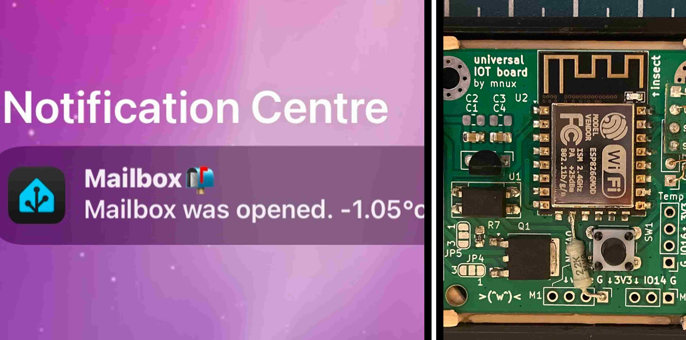

# Measuring camera shutter response time
 

## Overview
A mailbox sensor which sends me a notification through Home Assistant when I get mail. 

## Construction
This bracket securely mounts the IOT board to a box without adding a lot of height so the push button doesn't collide with the battery.

##  Inner workings

 

I made a simple binary counter combined with a camera remote shutter trigger. When I press the red start button, a short impulse is sent to the camera
to start an image capture. After that, the red LEDs start incrementing by 0.5 ms in binary. (You can guess who got their hands on a label maker during their summer job. :3)

After setting the camera exposure to the shortest possible value to capture only the current state of the LEDs, turning off autofocus and turning off live view, I can start measuring.

 

First, I tested my old Canon 500D. After taking a few images and confirming that I'm getting consistent readings, I convert the binary number to decimal.
Then, I divide the decimal number by 2, because the counter increments every 0.5 ms.

## The counter construction
I 3D printed a white box with holes for LEDs and switches. The resistor for the red LEDs is just 200Ω, which makes them bright and visible even
when shooting with a very fast shutter speed necessary for capturing the fast changing state of the counter. (In retrospect, I would use higher resistance
resistors, because the LEDs get overblown when increasing the exposure in GIMP later to see the inactive LEDs as well)  
I also added a lever switch which can half press the shutter button and get the camera to prepare (like focusing, etc.) to take a picture.  
I added a MOSFET switch, with which I can trigger higher current loads like LED strips to simulate lightning strikes.  

 

 

It is not the prettiest project by far, but it gets the job done. If you want to replicate or use parts of this project, you can get the firmware, schematics, and 3D files on my
<a href="https://github.com/Mnux9/shutter-lag-counter" style="color: deepSkyBlue; text-decoration: underline;text-decoration-style: dotted;">GitHub</a>.

## Conclusion
As somebody who has just failed math and electronic measurements in high school, I wasn't very sure about the accuracy. However, I compared my results to those
found on <a href="https://www.imaging-resource.com/PRODS/T1I/T1IA6.HTM" style="color: deepSkyBlue; text-decoration: underline;text-decoration-style: dotted;">
Imaging Resource</a> (a very indepth camera review site). Mine are about 10 ms off from their results. In my opinion, this could be because
I'm running newer firmware or because this camera has a really high shutter count now. Not sure, honestly but I think it gives me a good enough orientation number.  
Later, I found a description of their measuring setup
<a href="https://www.imaging-resource.com/ARTS/TESTS/TIMING.HTM" style="color: deepSkyBlue; text-decoration: underline;text-decoration-style: dotted;">
here</a>. 

I plan to update this article with more data and possible reason for the 10 ms mismatch.

<a  style="color: grey">
Published: 14.7. 2025</a> 

