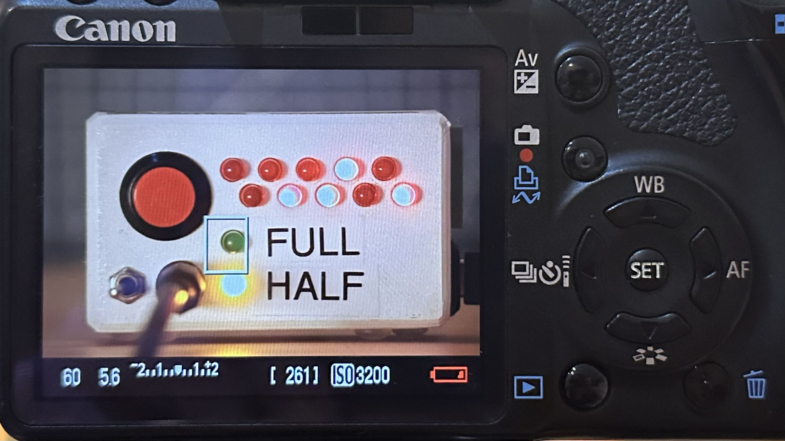
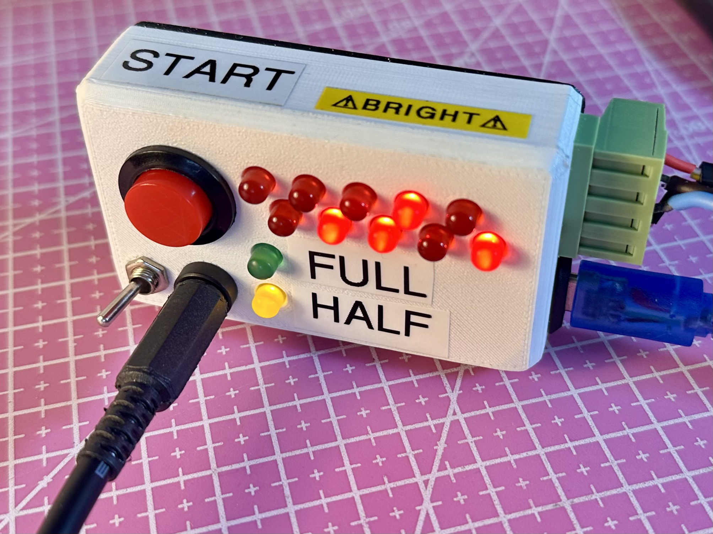
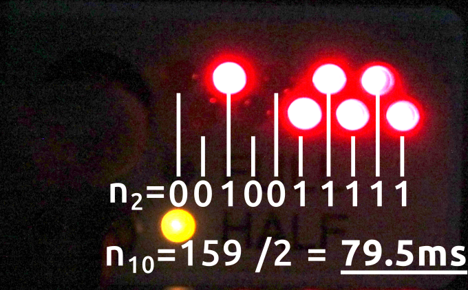
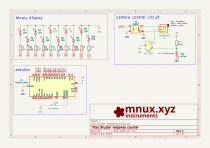
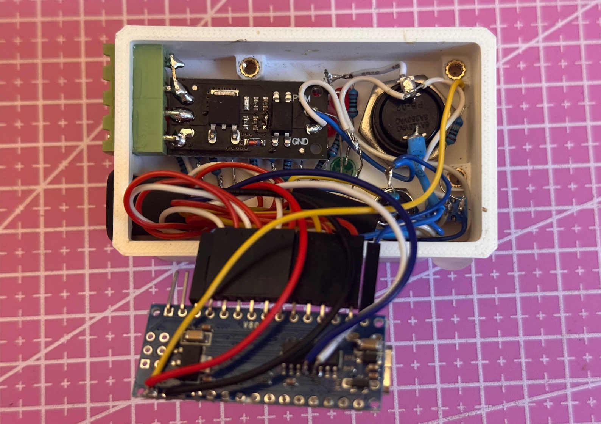

# Measuring camera shutter response time
 

### Overview
My setup for measuring shutter response time.

### Usecase
For the past few weeks I have been workig on a camera lightning trigger for lightning photography. This made me wonder how much time
does it take from triggering the shutter button to the start of an image acquisition on my cameras.

### Usage

 

I made a simple binary conter combined with a camera remote shutter trigger. When i press the red start button an short impulse is sent to the camera
to start an image capture after that the red LEDs start incrementing by 0.5ms in binary. (You can guess who got their hands on a label maker during their summer job :3)

Setting the camera exposure to the shortest exposure time to capture only the current state of the LEDs and turning off autofocus I can start measuring.

 

After I take a few images and confirm that Im getting a consistent reading i convert the binary number to decimal. Then I divide the number in deciman by 2 because the counter increments every 0.5ms.

## The counter construction
I 3D printed a white box with holes for leds and switches. The resistor for the red LEDs is just 200Ω which makes them bright and visible even 
when shooting with a very fast shutter speed which we need so we can capture the fast changing state of counter. (in retrospecive i would use higher resistance 
resistor because the LEDs get over blown when highering the exposure in gimp later to see the inactive leds)   I also added a switch which can
half press the shutter button and get the camera to prepare (like focusing etc.) to take a picture. 
I added a mosfet switch with which i can trigger higher current loads like LED strips to simulate lightning strikes. 

 

 

It is not the prettiest project by far but it gets the job done. If you want to replicate or use parts of this project you can get the firmware, schematics and 3D files on my 
<a href="https://github.com/Mnux9/shutter-lag-counter" style="color: deepSkyBlue; text-decoration: underline;text-decoration-style: dotted;">github</a>.

## Conclusion
As somebody who has just failed math and electronic measuerements in high school I wasnt very sure about the accuracy. However I compared my results to the results
found on <a href="https://www.imaging-resource.com/PRODS/T1I/T1IA6.HTM" style="color: deepSkyBlue; text-decoration: underline;text-decoration-style: dotted;">
Imaging Resource</a> (a very in depth camera review site). Mine are about 10ms off from the results on Imaging Resource. In my opinion this could be maybe because
Im running newer firmware or because this camera has a really high shutter count now. Not sure honestly but I think it gives me a good enough orientation number. 
Later I a description of their measuring setup
<a href="https://www.imaging-resource.com/ARTS/TESTS/TIMING.HTM" style="color: deepSkyBlue; text-decoration: underline;text-decoration-style: dotted;">
here</a>.