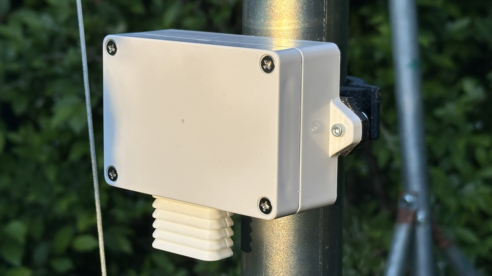
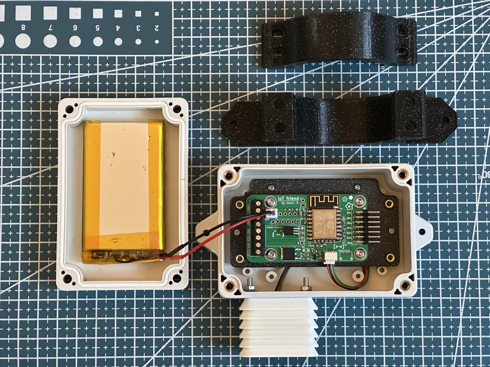

# Weather station
 

### Overview
A basic weather station built I with ESPHome for Home Assistant.

### Basic construction
I choose a small weather proof box and made a mounting bracked for my new IoT Friend board. The IoT Friend board was designed for all of my different ESPHome IoT projects, it allowed me to quickly build a basic Weather Station platform in a few hours. It has features for battery powered devices like being able to turn on/off power to the sensors. 
For start I added a 3000mAh battery, it will last around 5 days transmitting every 45 seconds. Which is just enough time for my solar panel to arrive.

### Temperature, humidity and pressure
Im starting with just a few small sensos i had on my desk. I found an AHT-20 for temp. and humidity and BMP-280 for pressure and temp.

 