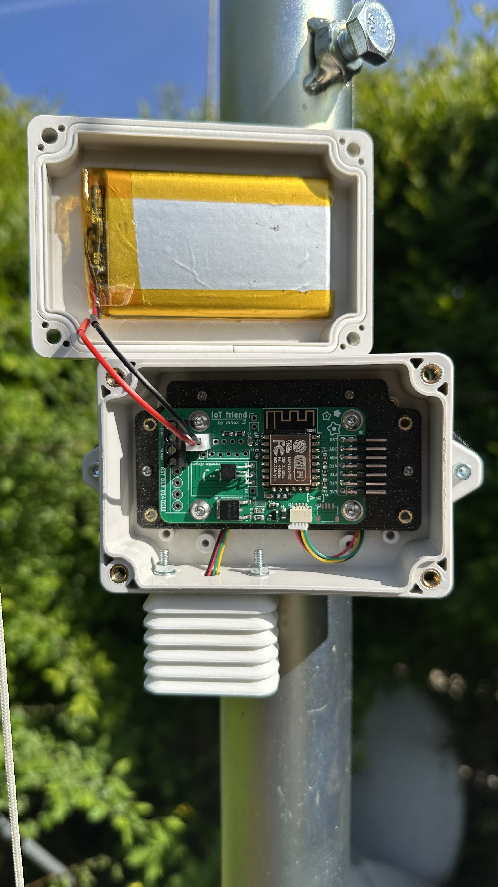

# Weather station
 

### Overview
A basic weather station built I will add new sensors and upgrades to over time and document them here.

### Temperature, humidity and pressure
Im starting with just a few small sensos i had on my desk. I found an AHT-20 for temp. and humidity and BMP-280 for pressure and temp.

 